# 🚀 Awesome Remote Pair Programming

<p align="center">
  
</p>

<p align="center">
  <a href="https://github.com/ishandutta2007/Awesome-Awesome-Awesome"></a><a href="https://discord.gg/jc4xtF58Ve"></a>
  <a href="https://github.com/ishandutta2007/Awesome-Remote-Pair-Programming/stargazers"></a>
  <a href="https://github.com/ishandutta2007/Awesome-Remote-Pair-Programming/network/members"></a>
  <a href="https://github.com/ishandutta2007/Awesome-Remote-Pair-Programming/blob/main/LICENSE"></a>
  <a href="https://github.com/ishandutta2007"></a>
</p>

---

## 📖 Overview

A definitive curated collection of the best **Remote Pair Programming**, **Collaborative Coding**, **Multiplayer IDEs**, and **Developer Screen Sharing** tools. Whether you are conducting technical interviews, practicing mob programming, onboarding junior engineers, or debugging distributed microservices with a teammate halfway across the globe, this repository catalogs both battle-tested commercial SaaS products and extensible open-source alternatives.

Real-time developer collaboration spans several primary technical paradigms:
- 🖥️ **Low-Latency Screen Sharing with Remote Control**: Purpose-built desktop streaming (e.g., Tuple, Hopp, CoScreen) offering 60 FPS 4K rendering, dual-mouse/keyboard input, and developer-tailored drawing annotations.
- 🧩 **IDE-Native Live Sharing**: Extension-based real-time synchronization (e.g., Visual Studio Live Share, JetBrains Code With Me, CodeTogether) that broadcasts syntax trees, cursors, local servers, and debuggers without transmitting raw screens.
- 🌐 **Browser-Based Multiplayer Sandboxes**: Instant web-based coding environments (e.g., Replit, CoderPad, code-server) utilizing WebSockets and CRDTs for frictionless pairing and technical screening.
- 💻 **Terminal Multiplexing & CLI Sharing**: SSH and tmux-based session mirrors (e.g., tmate, wemux) for lightning-fast command-line pair programming.

---

## 📑 Table of Contents

- [🚀 Awesome Remote Pair Programming](#-awesome-remote-pair-programming)
  - [📖 Overview](#-overview)
  - [📑 Table of Contents](#-table-of-contents)
  - [🏢 SaaS & Hosted Platforms](#-saas--hosted-platforms)
    - [📊 Market Size & Sector Fragmentation](#-market-size--sector-fragmentation)
    - [📋 SaaS Comparison Matrix](#-saas-comparison-matrix)
  - [💻 Open-Source GitHub Projects](#-open-source-github-projects)
  - [🛠️ Architecture & Implementation Paradigms](#️-architecture--implementation-paradigms)
  - [🤝 How to Contribute](#-how-to-contribute)
  - [📈 Star History](#-star-history)
  - [📜 Disclaimer](#-disclaimer)

---

## 🏢 SaaS & Hosted Platforms

### 📊 Market Size & Sector Fragmentation

> 🌐 **Industry Landscape & Market Dynamics**: The global developer collaboration and real-time remote pair programming sector is valued at **$2.8 Billion** as part of the broader **$24.5 Billion** developer tooling software market, projected to expand to **$58 Billion by 2030** at a **15.2% CAGR**. The market is **moderately fragmented**: mega-cap ecosystem platforms (Microsoft, Alphabet, Datadog) anchor ubiquitous baseline IDE plugins and cloud workstations, while high-velocity specialized innovators (Tuple, Replit, CoderPad, CodeTogether) command high-retention enterprise niches through dedicated ultra-low-latency screen sharing, sub-50ms peer-to-peer streaming, dual-cursor ergonomics, and compliance-grade interview sandboxes.

### 📋 SaaS Comparison Matrix

The table below is sorted by **Company Size / Valuation** in descending order:

| 🏷️ SaaS Product | 🏢 Company Valuation / Revenue | 💳 Pricing (Starting Tier) | 🎁 Free Tier Limits / Trial Limits | ⚡ Key Collaboration Features |
| :--- | :--- | :--- | :--- | :--- |
| **[Visual Studio Live Share](https://visualstudio.microsoft.com/services/live-share/)** | **$3.1 Trillion** *(Microsoft)* | **Included Free** with VS / VS Code ($45.00/user/mo for VS Pro) | **Free forever**: Up to 5 concurrent guests (expandable to 30 read-only guests), unlimited session duration | Bidirectional real-time co-editing, shared debugging, shared terminal sessions, local port/server forwarding, guest cursor tracking. |
| **[Google Project IDX & Workstations](https://idx.dev/)** | **$2.2 Trillion** *(Alphabet)* | **$0.20/hour** (~$15.00/month for Cloud Workstations) | **Free preview** (Project IDX 100% free); Google Cloud Free Tier includes **$300 credit for 90 days** | Cloud-native multiplatform pairing, browser workspace sharing, full Linux VM integration, pre-configured dev environments. |
| **[CoScreen](https://www.coscreen.co/)** | **$40.0 Billion** *(Datadog)* | **$15.00/user/month** *(Pro plan)* | **Free forever plan**: Up to 10 users, 60 minutes per multi-user screen sharing session | Simultaneous multi-application screen sharing, simultaneous multi-user mouse & keyboard remote control, built-in voice/video chat. |
| **[JetBrains Code With Me](https://www.jetbrains.com/code-with-me/)** | **$7.0 Billion** *(~$450M ARR)* | **$4.20/user/month** *(Enterprise)* / **$28.90/user/month** *(All Products Pack)* | **Free Community plan**: 30-minute max session duration, up to 3 guest participants per session | Native integration into all JetBrains IDEs (IntelliJ, PyCharm, WebStorm, GoLand), full code completion sync, P2P encrypted pairing, shared run/debug. |
| **[Replit Multiplayer](https://replit.com/)** | **$3.0 Billion** *(~$100M+ ARR)* | **$15.00/month** *(Replit Core billed annually at $120/yr, or $20/mo)* | **Free Starter plan forever**: Unlimited public repls, multiplayer real-time collaboration, 0.5 vCPU, 512MB RAM | Instant browser-based collaborative coding environment, live multi-cursor editing, interactive console, package management, one-click cloud hosting. |
| **[CoderPad Live](https://coderpad.io/)** | **$300 Million** *(~$50M ARR)* | **$250.00/month** *(Team plan)* or **$20.00/interview session** | **7-day free trial** with 2 live interview/pairing sessions included, or **Free Starter**: 2 sessions/month with persistent sandbox IDE | Purpose-built live technical interviews, real-time co-editing, sandbox execution in 30+ languages, drawing canvas, session playback. |
| **[Tuple](https://tuple.app/)** | **$90 Million** *(~$12M ARR)* | **$25.00/user/month** *(Tuple Pro)* | **14-day free trial**: Full access to 4K 60fps screen sharing, bidirectional remote control, unlimited 1-on-1 and group calls | Gold standard low-latency pairing app, native macOS/Linux/Windows clients, dual mouse/keyboard cursors, pencil drawing annotations, low CPU overhead. |
| **[CodeTogether](https://www.codetogether.com/)** | **$15 Million** *(~$15M ARR)* | **$8.00/user/month** *(Pro plan)* or **$16.00/user/month** *(Teams plan)* | **Free forever plan**: 45-minute session duration limit, max 4 participants per session, unlimited sessions | Cross-IDE live share solution supporting VS Code, IntelliJ, Eclipse, and browser guests; real-time co-editing, debugging, zero source code upload to server. |
| **[Duckly](https://duckly.com/)** *(formerly GitDuck)* | **$6 Million** *(~$1.5M ARR)* | **$12.00/user/month** | **14-day free trial**: Full access to P2P video calls, multi-IDE pairing, and shared terminal | P2P encrypted pair programming, multi-cursor editing across different IDEs (VS Code, IntelliJ), integrated video, audio, and terminal sharing. |

---

## 💻 Open-Source GitHub Projects

The following curated open-source repositories provide self-hosted remote desktop controls, multiplayer code editors, CRDT synchronization engines, and terminal multiplexers.

All repositories are sorted by **GitHub Star Count** in descending order:

1. **[RustDesk](https://github.com/rustdesk/rustdesk)** [](https://github.com/rustdesk/rustdesk/stargazers)  
   *An open-source remote desktop application designed for self-hosting as a full-control alternative to TeamViewer and Tuple. Features ultra-low-latency display streaming, full remote keyboard/mouse injection, end-to-end encryption, and multi-monitor developer workflows.*  
   `Language: Rust` • `License: AGPL-3.0 / GPL-3.0`

2. **[Zed](https://github.com/zed-industries/zed)** [](https://github.com/zed-industries/zed/stargazers)  
   *High-performance, multiplayer code editor from the creators of Atom and Tree-sitter. Features first-class remote pair programming built directly into the core editor: real-time collaborative buffer synchronization via CRDTs, shared follow-mode navigation, low-latency voice channels, and shared workspace tabs.*  
   `Language: Rust` • `License: GPL-3.0 / Apache-2.0`

3. **[code-server](https://github.com/coder/code-server)** [](https://github.com/coder/code-server/stargazers)  
   *Run Visual Studio Code on any remote Linux machine or cloud VM and access it securely through any modern web browser. Enables teams to pair on identical remote environments, share ports and terminals, and eliminate local machine configuration drift.*  
   `Language: TypeScript` • `License: MIT`

4. **[Yjs](https://github.com/yjs/yjs)** [](https://github.com/yjs/yjs/stargazers)  
   *High-performance Conflict-free Replicated Data Type (CRDT) engine engineered specifically for real-time collaborative text editing. Powers multiplayer Monaco, CodeMirror, and Quill bindings for custom pair programming and mob programming architectures.*  
   `Language: JavaScript` • `License: MIT`

5. **[Etherpad Lite](https://github.com/ether/etherpad-lite)** [](https://github.com/ether/etherpad-lite/stargazers)  
   *The pioneer of real-time collaborative document editing. Lightweight, self-hostable operational-transformation (OT) engine with authorship color coding, live chat, and an extensive plugin registry used for live scratchpad coding and collaborative reviews.*  
   `Language: JavaScript` • `License: Apache-2.0`

6. **[Screego](https://github.com/screego/server)** [](https://github.com/screego/server/stargazers)  
   *Screen sharing application purpose-built for developers. Offers low-latency WebRTC peer-to-peer screen streaming, multi-user cursor awareness, built-in room management, integrated voice chat, and simple Docker-based self-hosting.*  
   `Language: Go / TypeScript` • `License: GPL-3.0`

7. **[Automerge](https://github.com/automerge/automerge)** [](https://github.com/automerge/automerge/stargazers)  
   *A JSON-like CRDT library for building local-first, peer-to-peer collaborative software. Powers offline-first and distributed multiplayer coding tools with mathematical guarantees of eventual consistency and conflict resolution.*  
   `Language: Rust / JavaScript` • `License: MIT`

8. **[tmate](https://github.com/tmate-io/tmate)** [](https://github.com/tmate-io/tmate/stargazers)  
   *Instant terminal sharing utility based on tmux. Spawns an SSH session and generates an encrypted token link that teammates can use to attach to a live terminal session via SSH or HTML5 web console for pairing and remote incident triage.*  
   `Language: C` • `License: ISC`

9. **[wemux](https://github.com/zolrath/wemux)** [](https://github.com/zolrath/wemux/stargazers)  
   *Multi-user tmux wrapper enhancing terminal-based pair programming. Supports mirror mode (everyone shares cursor), pair mode (independent cursors on same window), and rogue mode (independent navigation across windows) for flexible team pairing.*  
   `Language: Shell` • `License: MIT`

10. **[Atom Teletype](https://github.com/atom/teletype)** [](https://github.com/atom/teletype/stargazers)  
    *Pioneering real-time pair programming package using WebSockets and WebRTC datachannels with CRDTs to synchronize buffer state directly between developer machines without transmitting code to cloud servers.*  
    `Language: JavaScript` • `License: MIT`

11. **[atom-pair](https://github.com/pusher/atom-pair)** [](https://github.com/pusher/atom-pair/stargazers)  
    *Real-time peer-to-peer collaborative coding package utilizing WebSockets for synchronized multi-cursor editing, color-coded participant cursors, and remote code pairing.*  
    `Language: CoffeeScript / JavaScript` • `License: MIT`

12. **[Leaps](https://github.com/Jeffail/leaps)** [](https://github.com/Jeffail/leaps/stargazers)  
    *A collaborative web-based pair programming service written in Go utilizing operational transformation (OT) algorithms for zero-latency concurrent code editing across distributed developers.*  
    `Language: Go` • `License: MIT`

13. **[Hopp](https://github.com/gethopp/hopp)** [](https://github.com/gethopp/hopp/stargazers)  
    *The modern purpose-built open-source remote pair programming application. Positions itself as a community-driven OSS alternative to Tuple, built with Tauri and Rust, featuring sub-100ms latency, remote mouse/keyboard control, and self-hosted signaling/relay options.*  
    `Language: Rust / TypeScript` • `License: AGPL-3.0`

14. **[Open Collaboration Tools (Eclipse OCT)](https://github.com/eclipse-oct/open-collaboration-tools)** [](https://github.com/eclipse-oct/open-collaboration-tools/stargazers)  
    *Open-source real-time live-sharing solution for Eclipse Theia, VS Code, and browser-based IDEs under the MIT license, enabling workspace sharing, remote follow, shared terminals, and co-debugging.*  
    `Language: TypeScript` • `License: MIT`

15. **[PairSync](https://github.com/subev/pairsync)** [](https://github.com/subev/pairsync/stargazers)  
    *Lightweight developer utility for live-syncing local working files across developer machines during pair programming so participants can contribute code from within their own native IDE setup.*  
    `Language: JavaScript` • `License: MIT`

16. **[PairPad](https://github.com/assishmoncs/pairpad)** [](https://github.com/assishmoncs/pairpad/stargazers)  
    *Full-stack open-source collaborative coding platform featuring Monaco Editor, CRDT-based concurrent editing, remote cursors, role-based rooms, and online code execution.*  
    `Language: TypeScript / React` • `License: MIT`

17. **[realmeet](https://github.com/PiyushAryan/realmeet)** [](https://github.com/PiyushAryan/realmeet/stargazers)  
    *Open-source, real-time collaborative coding platform designed for pair programming, technical interviews, code reviews, and live syntax-highlighted compilation.*  
    `Language: JavaScript / Node.js` • `License: MIT`

---

## 🛠️ Architecture & Implementation Paradigms

```
                      +------------------------------------------+
                      |       Remote Pair Programming Hub        |
                      +------------------------------------------+
                                           |
         +---------------------------------+---------------------------------+
         |                                 |                                 |
         v                                 v                                 v
+------------------+             +-------------------+             +------------------+
| Low-Latency      |             | IDE-Native State  |             | Cloud Sandboxes  |
| Video / Input    |             | Synchronization   |             | & Terminals      |
+------------------+             +-------------------+             +------------------+
| • Tuple          |             | • VS Live Share   |             | • Replit         |
| • Hopp           |             | • Code With Me    |             | • CoderPad       |
| • CoScreen       |             | • Zed / OCT       |             | • tmate / wemux  |
| • RustDesk       |             | • Yjs / Automerge |             | • code-server    |
+------------------+             +-------------------+             +------------------+
         |                                 |                                 |
         +---------------------------------+---------------------------------+
                                           |
                                           v
               +-------------------------------------------------------+
               |  Core Tech: WebRTC • CRDTs • OT • P2P Crypto • xterm  |
               +-------------------------------------------------------+
```

1. **Pixel Streaming vs. AST/Buffer Sharing**:
   - *Pixel Streaming (Tuple, Hopp, CoScreen, RustDesk)*: The host renders everything locally and transmits an encrypted video stream (VP8/VP9/H.264/AV1) with low-latency input event injection. This guarantees that host-specific compilers, linters, and proprietary local databases run seamlessly without sharing the underlying repository filesystem.
   - *Buffer & State Synchronization (Live Share, Code With Me, Zed, OCT)*: Transmits only text diffs and cursor offsets over WebSockets or WebRTC datachannels using CRDTs (Conflict-free Replicated Data Types) or Operational Transformation (OT). Minimizes bandwidth requirements (~kilobits/sec).

2. **Security & Privacy Considerations**:
   - Ensure tools provide explicit permission prompts before granting terminal write access or local port forwarding.
   - For enterprise IP compliance, prioritize tools supporting end-to-end encryption (E2EE) and self-hosted signaling relays (e.g., Hopp, RustDesk, Screego).

---

## 🤝 How to Contribute

Contributions are warmly encouraged! Help us keep this directory accurate and exhaustive:

1. 🍴 **Fork** the repository.
2. 🌿 Create a new feature branch: `git checkout -b add/new-pairing-tool`.
3. 📝 Add your tool adhering to the existing formatting guidelines:
   - For SaaS: Include specific starting tier pricing, explicit free tier limits, company valuation/revenue, and maintain descending valuation sort.
   - For Open-Source: Include the official GitHub star badge (`style=social&color=white`) linking to `/stargazers`, and maintain descending star count sort.
4. 🚀 Push to your branch and submit a **Pull Request**.

---

## 📈 Star History

[](https://star-history.dera.page/#ishandutta2007/Awesome-Remote-Pair-Programming&type=date&legend=top-left)

---

## 📜 Disclaimer

- This is a community-curated directory intended for research, comparison, and developer productivity reference.
- Product names, logos, and brands are property of their respective owners.
- Ensure appropriate security reviews and access policies before sharing production terminals or source code during remote pairing sessions.
